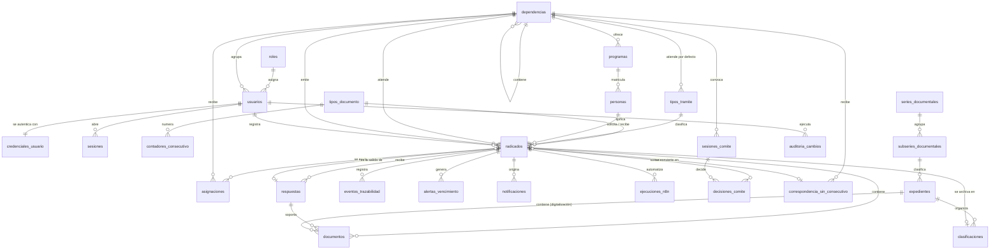

# Modelo de datos — Sistema de Gestión Documental (SGD)

> **Estado:** aprobado por el equipo el 24-sep-2026 e implementado en SQL (`00_esquema.sql` … `09_semilla.sql`,
> ver [README.md](README.md)). Probado en PostgreSQL 18.3 local: 26 pruebas de seguridad y 2.000 consecutivos simultáneos sin duplicados.
> **Motor:** PostgreSQL 16 (Supabase), acceso solo desde la API con Prisma (ADR-002, ADR-005).
> **Normalización:** Tercera Forma Normal (3FN). Las dos excepciones deliberadas están justificadas en §6.
> **Fuentes:** F-02 v1.0 (RF-001…RF-017, RN-001…RN-009), `ia_contexto/spec/REQUISITOS_DESARROLLO_SGD.md` §4
> (RF-018, RF-019, RN-010), `ia_contexto/spec/historias-juan-manuel.md` (notas de modelo, I-10),
> maquetación de interfaz v1.0 y flujos de n8n.
> Fecha: 24-sep-2026 · Autores: Juan Manuel Arteaga Flores · Juan David Burbano Manquillo.

**Objetivo de este documento:** que las tablas no haya que modificarlas después. Por eso:

- Todo lo que el cliente todavía no ha definido (plazos, umbrales del semáforo, dependencias, TRD,
  formato del consecutivo, festivos) se guarda como **datos configurables**, no como columnas ni
  valores fijos en el código. Cuando el cliente responda, se cargan filas; el esquema no cambia.
- Las listas que sí son cerradas por norma o por el flujo del sistema van como `ENUM`.
- Cada regla de negocio indica qué restricción de la base la hace cumplir (§7).

---

## 1. Convenciones

| Elemento | Convención | Ejemplo |
|---|---|---|
| Tablas | `snake_case`, plural, en español | `radicados`, `tipos_tramite` |
| Llave primaria | `id_<entidad en singular>` | `id_radicado` |
| Llave foránea | `<entidad referenciada en singular>_id` (o un nombre de rol cuando hay varias a la misma tabla) | `persona_id`, `anulado_por` |
| Tipo de PK | `integer GENERATED ALWAYS AS IDENTITY`; `bigint` solo en tablas de bitácora de alto volumen | — |
| Fechas con hora | `timestamptz` (se guarda en UTC; la interfaz muestra `America/Bogota`) | `fecha_radicacion` |
| Fechas sin hora | `date` | `fecha_limite` |
| Correos | `citext` (comparación sin mayúsculas/minúsculas) | `correo` |
| Auditoría de fila | `creado_en`, `actualizado_en` con valor por defecto `now()` y disparador de actualización | — |
| Borrado | **No existe.** Nada del dominio se borra: se anula, se deshabilita o se desactiva (RN-002, ADR-006) | — |

Extensiones de PostgreSQL necesarias: `citext` (correos) y `pg_trgm` (búsqueda por nombre y asunto, RF-009).

Esquema: todo va en un esquema propio **`sgd`**, no en `public` (ver §9, seguridad en Supabase).

---

## 2. Mapa de tablas

28 tablas en 6 grupos.

| # | Grupo | Tabla | Para qué |
|---|---|---|---|
| 1 | Catálogos | `roles` | Los 4 roles del panel interno |
| 2 | Catálogos | `dependencias` | Dependencias académicas y administrativas de la universidad |
| 3 | Catálogos | `programas` | Programas académicos (dato de la persona) |
| 4 | Catálogos | `tipos_documento` | Tipos con consecutivo propio: recibida, enviada, circular, resolución, convenio |
| 5 | Catálogos | `tipos_tramite` | Reingreso, homologación, tutela…: plazo y comité (RF-019, RN-007) |
| 6 | Catálogos | `festivos` | Días no hábiles para calcular plazos |
| 7 | Catálogos | `parametros_sistema` | Valores configurables (umbrales del semáforo, correos de copia…) |
| 8 | Seguridad | `usuarios` | Perfil de las cuentas del panel interno: nombre, rol, dependencia (RF-012) |
| 9 | Seguridad | `credenciales_usuario` | **Datos sensibles** de la cuenta: hash de contraseña y bloqueo (RF-013). Tabla aparte, 1 a 1 |
| 10 | Seguridad | `sesiones` | Refresh tokens de JWT, para poder revocarlos |
| 11 | Personas | `personas` | Remitentes, solicitantes y destinatarios, consultables por cédula (RF-007, RF-008) |
| 12 | Radicación | `contadores_consecutivo` | Último número por tipo de documento y año (RF-003, RN-001) |
| 13 | Radicación | `radicados` | Tabla central: toda comunicación con consecutivo |
| 14 | Radicación | `asignaciones` | Historial de envíos y reasignaciones a dependencias (RF-005) |
| 15 | Radicación | `respuestas` | Respuestas de la dependencia y su verificación por Recepción (RF-002, RN-008) |
| 16 | Radicación | `documentos` | Archivos adjuntos (RF-004, RNF-007) |
| 17 | Radicación | `correspondencia_sin_consecutivo` | Revistas, facturas, paquetes (RF-014, RN-006) |
| 18 | Comité | `sesiones_comite` | Reuniones del comité por dependencia |
| 19 | Comité | `decisiones_comite` | Decisión del comité sobre un radicado (RF-016) |
| 20 | Seguimiento | `eventos_trazabilidad` | Línea de tiempo inmutable de cada radicado (RF-006) |
| 21 | Seguimiento | `alertas_vencimiento` | Alertas generadas por el semáforo (RF-015) |
| 22 | Seguimiento | `notificaciones` | Registro de cada correo enviado o fallido |
| 23 | Seguimiento | `ejecuciones_n8n` | Ejecuciones de los flujos de n8n (clasificación y respuesta) |
| 24 | Seguimiento | `auditoria_cambios` | Quién cambió qué y cuándo (RN-003, panel de auditoría) |
| 25 | Archivo Central | `series_documentales` | Series de la TRD |
| 26 | Archivo Central | `subseries_documentales` | Subseries de la TRD |
| 27 | Archivo Central | `expedientes` | Expedientes clasificados por subserie (RF-010) |
| 28 | Archivo Central | `clasificaciones` | Radicado → expediente, con quién y cuándo lo clasificó |

---

## 3. Diagrama entidad-relación

Solo llaves y relaciones; las columnas completas están en §5. Todas las relaciones son 1—N, salvo
`usuarios` — `credenciales_usuario`, que es 1—1 (misma llave primaria).



---

## 4. Tipos enumerados (`ENUM`)

Solo listas cerradas por norma o por el flujo. Todo lo que el cliente puede cambiar es tabla (§5.1).

| Enum | Valores | Usado en |
|---|---|---|
| `estado_radicado` | `recibido`, `enviado`, `recibido_dependencia`, `en_revision_requisitos`, `en_comite`, `rechazado_requisitos`, `pendiente_verificacion`, `requiere_correccion`, `respondido`, `emitido`, `anulado` | `radicados`, `eventos_trazabilidad` |
| `canal_entrada` | `ventanilla`, `correo_electronico`, `plataforma_web`, `comunicacion_interna`, `portal_publico` | `radicados` |
| `semaforo` | `verde`, `amarillo`, `naranja`, `rojo` | `radicados` |
| `nivel_alerta` | `amarillo`, `naranja`, `rojo` | `alertas_vencimiento` |
| `tipo_identificacion` | `CC`, `TI`, `CE`, `PA`, `PPT`, `NIT`, `OTRO` | `personas` |
| `tipo_persona` | `natural`, `juridica` | `personas` |
| `estado_persona` | `activo`, `inactivo`, `egresado`, `retirado`, `externo` | `personas` |
| `tipo_dependencia` | `academica`, `administrativa` | `dependencias` |
| `origen_accion` | `usuario`, `portal`, `n8n`, `sistema` | `asignaciones`, `eventos_trazabilidad` |
| `tipo_evento` | `radicado`, `asignado`, `reasignado`, `recibido_dependencia`, `cambio_estado`, `respuesta_registrada`, `respuesta_verificada`, `respuesta_devuelta`, `decision_comite`, `documento_adjuntado`, `notificacion_enviada`, `clasificado`, `anulado` | `eventos_trazabilidad` |
| `estado_verificacion` | `pendiente`, `verificada`, `devuelta` | `respuestas` |
| `sentido_respuesta` | `aprobado`, `no_aprobado`, `informativa`, `rechazado_requisitos` | `respuestas` |
| `decision_comite` | `aprobado`, `no_aprobado`, `aplazado` | `decisiones_comite` |
| `estado_sesion_comite` | `programada`, `realizada`, `cancelada` | `sesiones_comite` |
| `tipo_elemento` | `revista`, `factura`, `paquete`, `documento_sin_firma`, `otro` | `correspondencia_sin_consecutivo` |
| `origen_documento` | `escaneo`, `digital`, `portal`, `respuesta`, `digitalizacion` | `documentos` |
| `estado_expediente` | `abierto`, `cerrado` | `expedientes` |
| `disposicion_final` | `conservacion_total`, `eliminacion`, `seleccion`, `digitalizacion` | `subseries_documentales` |
| `tipo_notificacion` | `radicado_creado`, `radicado_asignado`, `proximo_a_vencer`, `vencido`, `respuesta_verificada`, `respuesta_devuelta`, `copia_registro_academico` | `notificaciones` |
| `estado_notificacion` | `pendiente`, `enviada`, `fallida` | `notificaciones` |
| `estado_ejecucion` | `iniciado`, `finalizado`, `fallido` | `ejecuciones_n8n` |
| `accion_auditoria` | `crear`, `actualizar`, `deshabilitar`, `habilitar`, `anular`, `iniciar_sesion`, `inicio_sesion_fallido`, `cerrar_sesion` | `auditoria_cambios` |

**Transiciones de `estado_radicado`** (se validan en la capa de servicio; la tabla solo guarda el estado):

```
Comunicación de ENTRADA (recibida)
recibido ─▶ enviado ─▶ recibido_dependencia ─┬─▶ pendiente_verificacion ─┬─▶ respondido
                                             │                           └─▶ requiere_correccion ─▶ pendiente_verificacion
                                             └─▶ en_revision_requisitos ─┬─▶ en_comite ─▶ pendiente_verificacion
                                                                         └─▶ rechazado_requisitos ─▶ pendiente_verificacion
(enviado también puede pasar directo a pendiente_verificacion si la dependencia no marca "recibido")

SALIDA, CIRCULAR, RESOLUCIÓN, CONVENIO
emitido

Cualquier estado ─▶ anulado   (solo Administrador, con motivo; RF-011)
```

---

## 5. Tablas

Leyenda de columnas: **PK** llave primaria · **FK** llave foránea · **UK** única · **NN** no nula.

### 5.1 Catálogos

#### 1. `roles`

| Columna | Tipo | Restricciones | Descripción |
|---|---|---|---|
| `id_rol` | `smallint` identity | **PK** | |
| `codigo` | `varchar(30)` | **UK**, NN | `recepcion`, `dependencia`, `archivo_central`, `administrador`. El código lo usa la API para autorizar |
| `nombre` | `varchar(60)` | NN | Texto para la interfaz: "Recepción / Ventanilla" |
| `descripcion` | `text` | | |

Datos iniciales: los 4 roles. No hay pantalla para crear roles: son fijos (RF-012).

#### 2. `dependencias`

| Columna | Tipo | Restricciones | Descripción |
|---|---|---|---|
| `id_dependencia` | `integer` identity | **PK** | |
| `codigo` | `varchar(20)` | **UK**, NN | Sigla interna, p. ej. `FING`, `REGACAD` |
| `nombre` | `varchar(150)` | **UK**, NN | "Facultad de Ingeniería" |
| `tipo` | `tipo_dependencia` | NN | Académica o administrativa |
| `correo` | `citext` | NN | Correo al que n8n avisa las asignaciones |
| `dependencia_padre_id` | `integer` | **FK** → `dependencias`, null | Jerarquía (programa dentro de facultad, oficina dentro de vicerrectoría) |
| `categoria_n8n` | `varchar(60)` | UK, null | Etiqueta que devuelve el clasificador de IA de n8n para esta dependencia |
| `activa` | `boolean` | NN, default `true` | Se desactiva, nunca se borra |
| `creado_en` / `actualizado_en` | `timestamptz` | NN | |

#### 3. `programas`

| Columna | Tipo | Restricciones | Descripción |
|---|---|---|---|
| `id_programa` | `integer` identity | **PK** | |
| `nombre` | `varchar(150)` | **UK**, NN | "Ingeniería de Sistemas" |
| `dependencia_id` | `integer` | **FK** → `dependencias`, NN | Facultad a la que pertenece |
| `activo` | `boolean` | NN, default `true` | |

#### 4. `tipos_documento`

Cada fila tiene su propio contador anual (RF-003).

| Columna | Tipo | Restricciones | Descripción |
|---|---|---|---|
| `id_tipo_documento` | `smallint` identity | **PK** | |
| `codigo` | `varchar(20)` | **UK**, NN | `recibida`, `enviada`, `circular`, `resolucion`, `convenio` |
| `nombre` | `varchar(60)` | NN | "Comunicación recibida" |
| `prefijo` | `varchar(4)` | **UK**, NN, CHECK `^[A-Z]{2,4}$` | Va en el número visible: `CR`, `CE`, `CI`, `RE`, `CO` |
| `es_entrada` | `boolean` | NN | `true` solo para `recibida`: define si el radicado espera respuesta y tiene plazo |
| `permite_anulacion` | `boolean` | NN, default `true` | Regla general de anulación por tipo (RF-011). Una resolución además deja de ser anulable al notificarse (`radicados.notificado_en`) |

#### 5. `tipos_tramite`

| Columna | Tipo | Restricciones | Descripción |
|---|---|---|---|
| `id_tipo_tramite` | `integer` identity | **PK** | |
| `codigo` | `varchar(40)` | **UK**, NN, CHECK `^[a-z_]+$` | `homologacion`, `reingreso`, `tutela`… (lo usa el portal y n8n) |
| `nombre` | `varchar(100)` | **UK**, NN | "Homologación" |
| `descripcion` | `text` | | Texto de ayuda en el portal |
| `plazo_dias_habiles` | `smallint` | NN, CHECK `BETWEEN 1 AND 15` | RN-010: nunca más de 15 días hábiles |
| `requiere_comite` | `boolean` | NN, default `false` | RN-007 |
| `dependencia_sugerida_id` | `integer` | **FK** → `dependencias`, null | A dónde se envía si n8n no logra clasificar |
| `visible_en_portal` | `boolean` | NN, default `true` | Algunos trámites solo los radica Recepción |
| `activo` | `boolean` | NN, default `true` | Inactivo = no aparece para radicar; los radicados viejos lo conservan |
| `creado_en` / `actualizado_en` | `timestamptz` | NN | Los cambios de plazo quedan en `auditoria_cambios` |

#### 6. `festivos`

| Columna | Tipo | Restricciones | Descripción |
|---|---|---|---|
| `fecha` | `date` | **PK** | Día no hábil |
| `descripcion` | `varchar(100)` | NN | "Día de la Independencia" |

Los sábados y domingos no se cargan: la función de días hábiles ya los excluye. Aquí van los festivos
nacionales y los días de cierre de la universidad (P-03).

#### 7. `parametros_sistema`

Configuración que el cliente todavía no ha definido. Cambiar un valor es un `UPDATE`, no una migración.

| Columna | Tipo | Restricciones | Descripción |
|---|---|---|---|
| `clave` | `varchar(60)` | **PK** | |
| `valor` | `jsonb` | NN | |
| `descripcion` | `text` | NN | |
| `actualizado_por` | `integer` | **FK** → `usuarios`, null | |
| `actualizado_en` | `timestamptz` | NN | |

Claves iniciales:

| Clave | Valor inicial | Pendiente que resuelve |
|---|---|---|
| `semaforo.umbral_amarillo_pct` | `50` | I-05 umbrales del semáforo |
| `semaforo.umbral_naranja_pct` | `80` | I-05 |
| `consecutivo.formato` | `"{anio}-{prefijo}-{numero:05}"` | I-02 formato del consecutivo |
| `correo.registro_academico` | `"registro@…"` | P-14 copia a Registro Académico |
| `correo.recepcion` | `"recepcion@…"` | Copia de respuestas a Recepción |
| `portal.max_bytes_envio` | `104857600` (100 MB) | P-08 tamaño máximo |
| `alertas.anticipacion_dias` | `2` | P-13 anticipación de avisos |

### 5.2 Seguridad

La cuenta se divide en dos tablas 1 a 1 (D-BD-12):

- `usuarios`: el **perfil**. Lo lee casi toda la API (listados, autor de un evento, menú por rol).
- `credenciales_usuario`: los **datos sensibles**. Solo la lee y escribe el módulo de autenticación,
  con su propio rol de base (§9). Así un `SELECT *` o un `findMany()` sobre usuarios nunca trae el
  hash, y un fallo en otro módulo no alcanza las contraseñas.

#### 8. `usuarios` (perfil)

| Columna | Tipo | Restricciones | Descripción |
|---|---|---|---|
| `id_usuario` | `integer` identity | **PK** | |
| `nombre_completo` | `varchar(150)` | NN | |
| `correo` | `citext` | **UK**, NN | Correo institucional; también es el usuario de inicio de sesión |
| `rol_id` | `smallint` | **FK** → `roles`, NN | Un solo rol por usuario (RF-012) |
| `dependencia_id` | `integer` | **FK** → `dependencias`, NN | Todo usuario pertenece a una dependencia (Recepción, TIC, Archivo Central…). Para el rol `dependencia` define qué radicados ve |
| `activo` | `boolean` | NN, default `true` | Deshabilitar ≠ borrar |
| `deshabilitado_en` | `timestamptz` | null | |
| `deshabilitado_por` | `integer` | **FK** → `usuarios`, null | |
| `ultimo_acceso` | `timestamptz` | null | Se muestra en la gestión de usuarios |
| `creado_por` | `integer` | **FK** → `usuarios`, null | Null solo para el primer administrador (semilla) |
| `creado_en` / `actualizado_en` | `timestamptz` | NN | |

CHECK: `activo OR (deshabilitado_en IS NOT NULL AND deshabilitado_por IS NOT NULL)`.

#### 9. `credenciales_usuario` (datos sensibles)

| Columna | Tipo | Restricciones | Descripción |
|---|---|---|---|
| `usuario_id` | `integer` | **PK** y **FK** → `usuarios` | Misma llave que el perfil: relación 1 a 1 |
| `password_hash` | `varchar(255)` | NN | bcrypt (costo ≥ 12). Nunca se devuelve por la API ni va a la auditoría |
| `debe_cambiar_clave` | `boolean` | NN, default `true` | Obliga a cambiarla en el primer ingreso (usuarios creados por el Administrador) |
| `clave_actualizada_en` | `timestamptz` | NN, default `now()` | |
| `intentos_fallidos` | `smallint` | NN, default `0`, CHECK `>= 0` | Se reinicia al entrar bien |
| `bloqueado_hasta` | `timestamptz` | null | Bloqueo temporal tras varios intentos fallidos |
| `actualizado_en` | `timestamptz` | NN | |

- Se crea en la **misma transacción** que la fila de `usuarios`.
- Solo `sgd_auth` tiene permisos sobre esta tabla (§9); `sgd_api` no puede ni leerla.
- Los intentos de inicio de sesión cambian esta tabla, no el perfil: la auditoría de `usuarios` solo
  refleja cambios del Administrador (rol, dependencia, habilitar/deshabilitar).

#### 10. `sesiones`

Permite cerrar sesión de verdad y expulsar a un usuario deshabilitado aunque su JWT siga vigente.
Igual que `credenciales_usuario`, solo la toca el rol `sgd_auth` (§9.1).

| Columna | Tipo | Restricciones | Descripción |
|---|---|---|---|
| `id_sesion` | `integer` identity | **PK** | |
| `usuario_id` | `integer` | **FK** → `usuarios`, NN | |
| `refresh_token_hash` | `char(64)` | **UK**, NN | SHA-256 del refresh token; el token en claro nunca se guarda |
| `creado_en` | `timestamptz` | NN | |
| `expira_en` | `timestamptz` | NN | |
| `revocada_en` | `timestamptz` | null | Al cerrar sesión, deshabilitar al usuario o rotar el token |
| `ip` | `inet` | null | |
| `agente_usuario` | `varchar(300)` | null | |

Índice: `(usuario_id) WHERE revocada_en IS NULL`.

### 5.3 Personas

#### 11. `personas`

Estudiantes, solicitantes externos, entidades (juzgados, empresas) y cualquier remitente o destinatario.

| Columna | Tipo | Restricciones | Descripción |
|---|---|---|---|
| `id_persona` | `integer` identity | **PK** | |
| `tipo_identificacion` | `tipo_identificacion` | NN | |
| `numero_identificacion` | `varchar(20)` | NN, CHECK `^[0-9A-Za-z-]{3,20}$` | **Texto**, sin puntos: conserva ceros a la izquierda |
| `tipo_persona` | `tipo_persona` | NN, default `natural` | |
| `nombre_completo` | `varchar(200)` | NN | Nombre o razón social |
| `correo` | `citext` | null | |
| `celular` | `varchar(20)` | null | |
| `direccion` | `varchar(200)` | null | |
| `programa_id` | `integer` | **FK** → `programas`, null | Solo estudiantes |
| `estado` | `estado_persona` | NN, default `externo` | |
| `creado_por` | `integer` | **FK** → `usuarios`, null | Null si la creó el portal |
| `creado_en` / `actualizado_en` | `timestamptz` | NN | Cada edición deja registro en `auditoria_cambios` (RN-003) |

UK: `(tipo_identificacion, numero_identificacion)`.
Índices: `numero_identificacion` (búsqueda por cédula sin importar el tipo), trigram sobre `nombre_completo`.

### 5.4 Radicación

#### 12. `contadores_consecutivo`

| Columna | Tipo | Restricciones | Descripción |
|---|---|---|---|
| `tipo_documento_id` | `smallint` | **PK (1/2)**, **FK** → `tipos_documento` | |
| `anio` | `smallint` | **PK (2/2)**, CHECK `BETWEEN 2020 AND 2100` | El año es parte de la llave: por eso "reinicia" cada 1 de enero sin ningún proceso |
| `ultimo_numero` | `integer` | NN, default `0`, CHECK `>= 0` | |

Ningún rol escribe esta tabla directo: se usa solo por la función `sgd.siguiente_consecutivo()`
(§9.4), llamada **dentro de la misma transacción** que crea el radicado. La función ejecuta:

```sql
INSERT INTO sgd.contadores_consecutivo (tipo_documento_id, anio, ultimo_numero)
VALUES ($1, $2, 1)
ON CONFLICT (tipo_documento_id, anio)
DO UPDATE SET ultimo_numero = sgd.contadores_consecutivo.ultimo_numero + 1
RETURNING ultimo_numero;
```

El `ON CONFLICT … DO UPDATE` bloquea la fila: dos radicaciones simultáneas reciben números distintos (RN-001).
Nunca se usa `MAX(consecutivo) + 1`.

#### 13. `radicados` (tabla central)

| Columna | Tipo | Restricciones | Descripción |
|---|---|---|---|
| `id_radicado` | `integer` identity | **PK** | Id interno; no se muestra al ciudadano |
| `numero_radicado` | `varchar(30)` | **UK**, NN | Número visible, p. ej. `2026-CR-01487`. Lo arma la API con `consecutivo.formato` |
| `tipo_documento_id` | `smallint` | **FK** → `tipos_documento`, NN | |
| `anio` | `smallint` | NN | Año del consecutivo |
| `consecutivo` | `integer` | NN, CHECK `> 0` | Número dentro de su tipo y año |
| `tipo_tramite_id` | `integer` | **FK** → `tipos_tramite`, null | Obligatorio para entradas; null en circulares, resoluciones… |
| `canal` | `canal_entrada` | NN | El canal no cambia el tratamiento (RN-009) |
| `estado` | `estado_radicado` | NN | |
| `asunto` | `varchar(300)` | NN | |
| `descripcion` | `text` | null | Texto de la solicitud |
| `observaciones` | `text` | null | Notas internas; nunca se muestran en el portal |
| `persona_id` | `integer` | **FK** → `personas`, null | Remitente en entradas; destinatario en salidas y convenios |
| `dependencia_id` | `integer` | **FK** → `dependencias`, null | Dependencia **actual** a cargo. Null mientras n8n no clasifica |
| `dependencia_emisora_id` | `integer` | **FK** → `dependencias`, null | Quien emite una salida, circular o resolución |
| `correo_notificacion` | `citext` | null | Correo al que se envía la respuesta (en el portal lo escribe el solicitante; RN-008) |
| `autoriza_tratamiento_datos` | `boolean` | NN, default `false` | Aceptación del aviso de privacidad (Ley 1581) |
| `fecha_autorizacion_datos` | `timestamptz` | null | |
| `fecha_radicacion` | `timestamptz` | NN, default `now()` | Inicio del plazo |
| `fecha_documento` | `date` | null | Fecha del papel si se radica tarde |
| `numero_folios` | `integer` | null, CHECK `> 0` | Páginas del paquete físico |
| `plazo_dias_habiles` | `smallint` | null | **Copia** del plazo del trámite al radicar (§6) |
| `fecha_limite` | `date` | null | Calculada al radicar con días hábiles y `festivos`; null si no espera respuesta |
| `semaforo` | `semaforo` | null | **Caché** que recalcula la tarea de alertas (§6); null si no espera respuesta |
| `fecha_respuesta` | `timestamptz` | null | Cuando pasa a `respondido` |
| `notificado_en` | `timestamptz` | null | Resolución notificada: desde aquí deja de ser anulable |
| `anulado_en` | `timestamptz` | null | |
| `anulado_por` | `integer` | **FK** → `usuarios`, null | |
| `motivo_anulacion` | `text` | null | |
| `registrado_por` | `integer` | **FK** → `usuarios`, null | Null cuando viene del portal |
| `ip_origen` | `inet` | null | Solo portal, para control de abuso. Dato personal: se conserva el mínimo tiempo necesario |
| `creado_en` / `actualizado_en` | `timestamptz` | NN | |

Restricciones:

- UK `(tipo_documento_id, anio, consecutivo)` — segunda barrera contra duplicados (RN-001, RNF-006).
- CHECK anulación: `(estado = 'anulado') = (anulado_en IS NOT NULL AND anulado_por IS NOT NULL AND motivo_anulacion IS NOT NULL)`.
- CHECK portal: `canal <> 'portal_publico' OR (autoriza_tratamiento_datos AND correo_notificacion IS NOT NULL AND registrado_por IS NULL)`.
- CHECK autorización: `NOT autoriza_tratamiento_datos OR fecha_autorizacion_datos IS NOT NULL`.
- CHECK plazo: `(fecha_limite IS NULL) = (plazo_dias_habiles IS NULL)`.
- CHECK `numero_radicado ~ '^[0-9]{4}-[A-Z]{2,4}-[0-9]{3,}$'`.

Índices (RNF-001: listado de 500 en < 3 s):

- `(dependencia_id, estado, fecha_limite)` — bandeja de la dependencia ordenada por vencimiento.
- `(estado, semaforo)` — alertas y tablero.
- `(persona_id, fecha_radicacion DESC)` — historial por cédula (RF-007).
- `(fecha_radicacion DESC)`, `(tipo_tramite_id)`, `(tipo_documento_id, anio)` — filtros de RF-009.
- Trigram sobre `asunto` — búsqueda por texto.

#### 14. `asignaciones`

Cada envío o reasignación a una dependencia (RF-005). `radicados.dependencia_id` guarda la vigente.

| Columna | Tipo | Restricciones | Descripción |
|---|---|---|---|
| `id_asignacion` | `integer` identity | **PK** | |
| `radicado_id` | `integer` | **FK** → `radicados`, NN | |
| `dependencia_id` | `integer` | **FK** → `dependencias`, NN | |
| `origen` | `origen_accion` | NN | `usuario` (Recepción) o `n8n` (clasificador) |
| `asignado_por` | `integer` | **FK** → `usuarios`, null | Null si la hizo n8n |
| `ejecucion_n8n_id` | `integer` | **FK** → `ejecuciones_n8n`, null | Qué ejecución de n8n la hizo |
| `motivo` | `text` | null | Obligatorio al reasignar (lo exige la API) |
| `asignado_en` | `timestamptz` | NN, default `now()` | |
| `recibido_en` | `timestamptz` | null | Cuando la dependencia marca "recibido" |
| `recibido_por` | `integer` | **FK** → `usuarios`, null | |
| `vigente` | `boolean` | NN, default `true` | Solo una vigente por radicado |

- UK parcial: `(radicado_id) WHERE vigente` — nunca dos dependencias a cargo a la vez.
- CHECK: `origen <> 'usuario' OR asignado_por IS NOT NULL`; `origen <> 'n8n' OR ejecucion_n8n_id IS NOT NULL`.

#### 15. `respuestas`

Cada intento de respuesta de la dependencia. Si Recepción la devuelve, la corrección es una fila nueva:
así queda el historial completo de devoluciones.

| Columna | Tipo | Restricciones | Descripción |
|---|---|---|---|
| `id_respuesta` | `integer` identity | **PK** | |
| `radicado_id` | `integer` | **FK** → `radicados`, NN | Radicado de **entrada** que se responde |
| `dependencia_id` | `integer` | **FK** → `dependencias`, NN | Quien responde |
| `sentido` | `sentido_respuesta` | NN | |
| `contenido` | `text` | NN | Texto de la respuesta |
| `respondido_por` | `integer` | **FK** → `usuarios`, NN | |
| `respondido_en` | `timestamptz` | NN, default `now()` | |
| `estado_verificacion` | `estado_verificacion` | NN, default `pendiente` | RN-008 |
| `verificado_por` | `integer` | **FK** → `usuarios`, null | Usuario de Recepción |
| `verificado_en` | `timestamptz` | null | |
| `observacion_verificacion` | `text` | null | Por qué se devolvió |
| `radicado_salida_id` | `integer` | **FK** → `radicados`, **UK**, null | Comunicación de salida (tipo `enviada`) creada **al verificar**. Así las respuestas devueltas no consumen consecutivo |

- UK parcial: `(radicado_id) WHERE estado_verificacion = 'verificada'` — una sola respuesta válida por radicado.
- CHECK verificada: `estado_verificacion <> 'verificada' OR (verificado_por IS NOT NULL AND verificado_en IS NOT NULL AND radicado_salida_id IS NOT NULL)`.
- CHECK devuelta: `estado_verificacion <> 'devuelta' OR (verificado_por IS NOT NULL AND observacion_verificacion IS NOT NULL)`.

Salida independiente (RF-002, flujo alternativo): es un `radicado` de tipo `enviada` sin fila en `respuestas`.

#### 16. `documentos`

Archivos adjuntos. El archivo vive en el almacenamiento de objetos (MinIO / Supabase Storage); aquí solo sus metadatos.

| Columna | Tipo | Restricciones | Descripción |
|---|---|---|---|
| `id_documento` | `integer` identity | **PK** | |
| `radicado_id` | `integer` | **FK** → `radicados`, null | |
| `respuesta_id` | `integer` | **FK** → `respuestas`, null | Documento de respuesta |
| `expediente_id` | `integer` | **FK** → `expedientes`, null | Solo digitalización de archivo físico sin radicado |
| `nombre_original` | `varchar(255)` | NN | Solo para mostrar; **nunca** se usa para construir rutas |
| `clave_almacenamiento` | `varchar(300)` | **UK**, NN | Ruta interna generada por la API (UUID) |
| `tipo_mime` | `varchar(100)` | NN, CHECK en (`application/pdf`, `image/png`, `image/jpeg`, `image/tiff`) | Validado por contenido, no por extensión |
| `tamano_bytes` | `bigint` | NN, CHECK `> 0` | Paquetes de hasta 100 MB (RNF-007) |
| `hash_sha256` | `char(64)` | NN | Detecta corrupción o duplicados |
| `paginas` | `integer` | null, CHECK `> 0` | |
| `origen` | `origen_documento` | NN | |
| `fecha_documento_original` | `date` | null | Digitalización |
| `ubicacion_fisica` | `varchar(200)` | null | "Caja 14 · Carpeta 3 · Estante B" |
| `subido_por` | `integer` | **FK** → `usuarios`, null | Null si lo subió el portal |
| `subido_en` | `timestamptz` | NN, default `now()` | |
| `anulado_en` | `timestamptz` | null | Un adjunto equivocado se anula, no se borra |
| `anulado_por` | `integer` | **FK** → `usuarios`, null | |
| `motivo_anulacion` | `text` | null | |

- CHECK: exactamente un padre: `num_nonnulls(radicado_id, respuesta_id, expediente_id) = 1`.
- CHECK anulación: los tres campos de anulación juntos o ninguno.
- Índices: `radicado_id`, `respuesta_id`, `expediente_id`, `hash_sha256`.

#### 17. `correspondencia_sin_consecutivo`

| Columna | Tipo | Restricciones | Descripción |
|---|---|---|---|
| `id_correspondencia` | `integer` identity | **PK** | |
| `tipo_elemento` | `tipo_elemento` | NN | |
| `remitente` | `varchar(200)` | null | Texto libre: muchas veces no se conoce |
| `persona_id` | `integer` | **FK** → `personas`, null | Si el remitente ya existe |
| `dependencia_destino_id` | `integer` | **FK** → `dependencias`, NN | |
| `fecha_recepcion` | `timestamptz` | NN, default `now()` | |
| `observaciones` | `text` | null | |
| `registrado_por` | `integer` | **FK** → `usuarios`, NN | |
| `entregado_en` | `timestamptz` | null | Cuando se entregó a la dependencia |
| `radicado_id` | `integer` | **FK** → `radicados`, **UK**, null | Si luego se decidió radicarlo ("en realidad sí debe radicarse") |

No toca `contadores_consecutivo` (RN-006).

### 5.5 Comité

#### 18. `sesiones_comite`

| Columna | Tipo | Restricciones | Descripción |
|---|---|---|---|
| `id_sesion_comite` | `integer` identity | **PK** | |
| `dependencia_id` | `integer` | **FK** → `dependencias`, NN | Comité de qué programa o facultad |
| `fecha` | `date` | NN | Fecha programada o realizada |
| `estado` | `estado_sesion_comite` | NN, default `programada` | |
| `acta_numero` | `varchar(40)` | null | |
| `observaciones` | `text` | null | |
| `creado_por` | `integer` | **FK** → `usuarios`, NN | |
| `creado_en` | `timestamptz` | NN | |

UK: `(dependencia_id, fecha)`. De aquí sale la "próxima reunión del comité" que muestra la interfaz.

#### 19. `decisiones_comite`

| Columna | Tipo | Restricciones | Descripción |
|---|---|---|---|
| `id_decision` | `integer` identity | **PK** | |
| `radicado_id` | `integer` | **FK** → `radicados`, NN | |
| `sesion_comite_id` | `integer` | **FK** → `sesiones_comite`, NN | |
| `decision` | `decision_comite` | NN | `aplazado` deja el radicado en comité para la siguiente sesión |
| `observacion` | `text` | null | |
| `registrado_por` | `integer` | **FK** → `usuarios`, NN | |
| `registrado_en` | `timestamptz` | NN, default `now()` | |

UK: `(radicado_id, sesion_comite_id)` — una decisión por radicado en cada sesión.

### 5.6 Seguimiento

#### 20. `eventos_trazabilidad`

Línea de tiempo del radicado (RF-006). **Solo inserción**: un disparador rechaza `UPDATE` y `DELETE`.

| Columna | Tipo | Restricciones | Descripción |
|---|---|---|---|
| `id_evento` | `bigint` identity | **PK** | |
| `radicado_id` | `integer` | **FK** → `radicados`, NN | |
| `tipo_evento` | `tipo_evento` | NN | |
| `estado_anterior` | `estado_radicado` | null | |
| `estado_nuevo` | `estado_radicado` | null | |
| `origen` | `origen_accion` | NN | |
| `usuario_id` | `integer` | **FK** → `usuarios`, null | Quién, si fue una persona del panel |
| `dependencia_id` | `integer` | **FK** → `dependencias`, null | Dependencia involucrada (asignación, respuesta) |
| `detalle` | `text` | null | Texto para la línea de tiempo, p. ej. motivo de reasignación |
| `ocurrido_en` | `timestamptz` | NN, default `now()` | |

- CHECK: `(origen = 'usuario') = (usuario_id IS NOT NULL)` — un evento del portal, n8n o el sistema no puede atribuirse a un usuario.
- Índice: `(radicado_id, ocurrido_en)`.
- Se inserta **en la misma transacción** que el cambio que describe.

#### 21. `alertas_vencimiento`

| Columna | Tipo | Restricciones | Descripción |
|---|---|---|---|
| `id_alerta` | `integer` identity | **PK** | |
| `radicado_id` | `integer` | **FK** → `radicados`, NN | |
| `nivel` | `nivel_alerta` | NN | |
| `por_espera_comite` | `boolean` | NN, default `false` | El retraso es del comité, no de la dependencia (RF-015) |
| `mensaje` | `varchar(300)` | NN | |
| `generada_en` | `timestamptz` | NN, default `now()` | |
| `atendida` | `boolean` | NN, default `false` | |
| `atendida_por` | `integer` | **FK** → `usuarios`, null | |
| `atendida_en` | `timestamptz` | null | |

- UK: `(radicado_id, nivel)` — la tarea periódica no repite la misma alerta (HU-015).
- Índice: `(atendida, generada_en DESC)`.

#### 22. `notificaciones`

Evidencia de cada correo (a la dependencia, a Recepción, a Registro Académico y al solicitante).

| Columna | Tipo | Restricciones | Descripción |
|---|---|---|---|
| `id_notificacion` | `integer` identity | **PK** | |
| `tipo` | `tipo_notificacion` | NN | |
| `radicado_id` | `integer` | **FK** → `radicados`, null | |
| `destinatario_correo` | `citext` | NN | |
| `usuario_id` | `integer` | **FK** → `usuarios`, null | Si el destinatario es un usuario interno |
| `estado` | `estado_notificacion` | NN, default `pendiente` | |
| `intentos` | `smallint` | NN, default `0` | |
| `ultimo_error` | `text` | null | |
| `ejecucion_n8n_id` | `integer` | **FK** → `ejecuciones_n8n`, null | Ejecución que la envió |
| `creado_en` | `timestamptz` | NN | |
| `enviada_en` | `timestamptz` | null | |

Índice: `(estado, creado_en)` para reintentos.

#### 23. `ejecuciones_n8n`

(Se llama `WORKFLOW_N8N_EJECUCIONES` en `REQUISITOS_DESARROLLO_SGD.md`.)

| Columna | Tipo | Restricciones | Descripción |
|---|---|---|---|
| `id_ejecucion` | `integer` identity | **PK** | |
| `radicado_id` | `integer` | **FK** → `radicados`, null | |
| `flujo` | `varchar(80)` | NN | `seleccion_filtrado_envio` o `respuesta_solicitante` |
| `id_ejecucion_externa` | `varchar(80)` | null | Id de la ejecución en n8n, para depurar |
| `estado` | `estado_ejecucion` | NN, default `iniciado` | |
| `resultado` | `jsonb` | null | P. ej. categoría y confianza del clasificador de IA |
| `error` | `text` | null | |
| `iniciado_en` | `timestamptz` | NN, default `now()` | |
| `finalizado_en` | `timestamptz` | null | |

CHECK: `estado = 'iniciado' OR finalizado_en IS NOT NULL`.

#### 24. `auditoria_cambios`

**Solo inserción** (disparador bloquea `UPDATE` y `DELETE`). Alimenta el panel de auditoría.

| Columna | Tipo | Restricciones | Descripción |
|---|---|---|---|
| `id_auditoria` | `bigint` identity | **PK** | |
| `usuario_id` | `integer` | **FK** → `usuarios`, null | Null en inicios de sesión fallidos o acciones del sistema |
| `accion` | `accion_auditoria` | NN | |
| `tabla_afectada` | `varchar(60)` | NN | `personas`, `usuarios`, `tipos_tramite`, `radicados`… |
| `id_registro` | `varchar(40)` | NN | Id de la fila afectada (texto para admitir llaves compuestas) |
| `valores_anteriores` | `jsonb` | null | Solo los campos que cambiaron. **Nunca** contraseñas ni hashes |
| `valores_nuevos` | `jsonb` | null | |
| `ip` | `inet` | null | |
| `ocurrido_en` | `timestamptz` | NN, default `now()` | |

Índices: `(tabla_afectada, id_registro)`, `(usuario_id, ocurrido_en DESC)`, `(ocurrido_en DESC)`.

### 5.7 Archivo Central (TRD)

La TRD y la definición exacta de "expediente" siguen pendientes con Archivo Central (P-07).
Este diseño sigue la estructura estándar del AGN (serie → subserie → expediente → documento), así que
la respuesta del cliente se carga como filas.

#### 25. `series_documentales`

| Columna | Tipo | Restricciones | Descripción |
|---|---|---|---|
| `id_serie` | `integer` identity | **PK** | |
| `codigo` | `varchar(20)` | **UK**, NN | Código de la TRD |
| `nombre` | `varchar(150)` | NN | "Historias académicas" |
| `dependencia_id` | `integer` | **FK** → `dependencias`, null | Dependencia productora según la TRD |
| `activa` | `boolean` | NN, default `true` | |

#### 26. `subseries_documentales`

| Columna | Tipo | Restricciones | Descripción |
|---|---|---|---|
| `id_subserie` | `integer` identity | **PK** | |
| `serie_id` | `integer` | **FK** → `series_documentales`, NN | |
| `codigo` | `varchar(20)` | NN | |
| `nombre` | `varchar(150)` | NN | "Homologaciones" |
| `retencion_gestion_anios` | `smallint` | NN, CHECK `>= 0` | Años en archivo de gestión |
| `retencion_central_anios` | `smallint` | NN, CHECK `>= 0` | Años en Archivo Central |
| `disposicion_final` | `disposicion_final` | NN | |
| `activa` | `boolean` | NN, default `true` | |

UK: `(serie_id, codigo)`. El código TRD completo es `serie.codigo || '.' || subserie.codigo` (se calcula, no se guarda).

#### 27. `expedientes`

| Columna | Tipo | Restricciones | Descripción |
|---|---|---|---|
| `id_expediente` | `integer` identity | **PK** | |
| `codigo` | `varchar(30)` | **UK**, NN | `EXP-2026-0114` |
| `nombre` | `varchar(200)` | NN | |
| `subserie_id` | `integer` | **FK** → `subseries_documentales`, NN | Clasificación TRD del expediente |
| `dependencia_id` | `integer` | **FK** → `dependencias`, NN | Dependencia productora |
| `persona_id` | `integer` | **FK** → `personas`, null | Titular, p. ej. historia académica de un estudiante |
| `estado` | `estado_expediente` | NN, default `abierto` | |
| `fecha_apertura` | `date` | NN | |
| `fecha_cierre` | `date` | null | Inicia el conteo de retención |
| `ubicacion_fisica` | `varchar(200)` | null | |
| `creado_por` | `integer` | **FK** → `usuarios`, NN | |
| `creado_en` / `actualizado_en` | `timestamptz` | NN | |

CHECK: `(estado = 'cerrado') = (fecha_cierre IS NOT NULL)`; `fecha_cierre >= fecha_apertura`.

#### 28. `clasificaciones`

(Reemplaza a `CLASIFICACIONES_DOCUMENTALES` del documento base; ver §8.)

| Columna | Tipo | Restricciones | Descripción |
|---|---|---|---|
| `id_clasificacion` | `integer` identity | **PK** | |
| `radicado_id` | `integer` | **FK** → `radicados`, **UK**, NN | Un radicado se archiva en un solo expediente |
| `expediente_id` | `integer` | **FK** → `expedientes`, NN | |
| `orden_en_expediente` | `integer` | NN, CHECK `> 0` | Organización cronológica (RF-010) |
| `observaciones` | `text` | null | |
| `clasificado_por` | `integer` | **FK** → `usuarios`, NN | |
| `clasificado_en` | `timestamptz` | NN, default `now()` | |

UK: `(expediente_id, orden_en_expediente)`.
"Documentos por clasificar" = radicados en estado `respondido` o `emitido` sin fila aquí.

---

## 6. Decisiones de diseño

| # | Decisión | Por qué |
|---|---|---|
| D-BD-01 | Todo lo que el cliente no ha definido es **dato** (`parametros_sistema`, `tipos_tramite`, `tipos_documento`, `festivos`, TRD, dependencias) | Las respuestas pendientes (I-02, I-05, P-03, P-06, P-07, P-08, P-13, P-14) no obligan a cambiar tablas |
| D-BD-02 | `radicados.plazo_dias_habiles` y `fecha_limite` se **copian** al radicar | Excepción deliberada a "no guardar lo calculable": HU-019 exige que cambiar el plazo de un trámite no altere los radicados existentes. Es una foto del plazo vigente, no un dato derivado |
| D-BD-03 | `radicados.semaforo` es una **caché** | Permite filtrar por color con índice (RNF-001). La tarea de alertas la recalcula; la ficha del radicado la calcula al vuelo. Nunca se edita a mano |
| D-BD-04 | `radicados.dependencia_id` (actual) + `asignaciones` (historial) | La bandeja consulta la actual con índice; el historial conserva todas las reasignaciones. Se escriben en la misma transacción |
| D-BD-05 | El consecutivo de salida se asigna **al verificar** la respuesta | Las respuestas devueltas por Recepción no gastan números |
| D-BD-06 | Una fila de `respuestas` por intento | Queda el historial de devoluciones y correcciones (RN-008) |
| D-BD-07 | Todo usuario tiene dependencia (`NOT NULL`) | Recepción, TIC y Archivo Central también son dependencias; evita casos especiales |
| D-BD-08 | Correos en `citext`, cédulas en texto | `Ana@X.co` = `ana@x.co`; conservar ceros a la izquierda |
| D-BD-09 | Series y subseries en tablas propias | En el documento base eran texto repetido en cada clasificación (viola 3FN) |
| D-BD-10 | Enums solo para listas cerradas | Agregar un valor a un enum requiere migración; por eso lo configurable es tabla |
| D-BD-11 | Ids enteros (`integer`), `bigint` solo en bitácoras | Suficiente para una universidad y evita el manejo de `BigInt` en JSON con Prisma |
| D-BD-12 | La cuenta se divide en `usuarios` (perfil) y `credenciales_usuario` (sensible), 1 a 1 | Evita que el hash salga por descuido en un listado; permite que solo el módulo de autenticación tenga permisos sobre las contraseñas; el login no toca el perfil |
| D-BD-13 | RLS en las 28 tablas, con políticas basadas en variables de sesión y no en `auth.uid()` | El sistema no usa Supabase Auth; RLS es la segunda barrera si un endpoint olvida filtrar por dependencia (§9) |
| D-BD-14 | El contador y la consulta pública solo por funciones `SECURITY DEFINER` | Ningún rol toca `contadores_consecutivo` directo; el portal nunca lee tablas con datos personales |

---

## 7. Cómo la base hace cumplir las reglas de negocio

| Regla | Restricción en la base | Lo que queda en la API |
|---|---|---|
| RN-001 consecutivo único | PK `(tipo_documento_id, anio)` en contadores + `UPSERT` con bloqueo + UK `(tipo_documento_id, anio, consecutivo)` y UK `numero_radicado` | Llamar al contador dentro de la transacción |
| RN-002 nada se borra | Disparador que rechaza `DELETE` en `radicados`, `personas`, `usuarios`, `documentos`, `respuestas`, `expedientes`; CHECK de anulación | Endpoint de anulación solo para Administrador |
| RN-003 auditoría de personas | Tabla `auditoria_cambios` solo-inserción | Escribir la auditoría en la misma transacción que el cambio |
| RN-004 solo Admin gestiona usuarios | `usuarios.creado_por`, `deshabilitado_por` | Autorización por rol en el endpoint |
| RN-005 responsabilidad de la dependencia | `fecha_limite` desde `fecha_radicacion` (no desde la asignación) | — |
| RN-006 sin consecutivo | Tabla separada que no toca contadores | — |
| RN-007 plazo y comité por trámite | `tipos_tramite.plazo_dias_habiles`, `requiere_comite` | — |
| RN-008 verificación y respuesta solo por correo | `respuestas.estado_verificacion` + CHECKs + `notificaciones` | Webhook a n8n solo al verificar |
| RN-009 mismo trato por canal | Mismas columnas para todos los canales; CHECK del portal | El portal usa el mismo servicio de radicación |
| RN-010 máximo 15 días hábiles | CHECK `plazo_dias_habiles BETWEEN 1 AND 15` | — |
| RF-006 trazabilidad inmutable | Disparador que rechaza `UPDATE`/`DELETE` en `eventos_trazabilidad` | Insertar evento en cada transacción de cambio |
| RF-015 alertas sin duplicar | UK `(radicado_id, nivel)` | Tarea periódica |
| Una sola dependencia a cargo | UK parcial `asignaciones (radicado_id) WHERE vigente` | — |
| Una sola respuesta válida | UK parcial `respuestas (radicado_id) WHERE verificada` | — |

Disparadores:

| Disparador | Tablas | Qué hace |
|---|---|---|
| `tg_actualizado_en` | todas las que tienen `actualizado_en` | Pone `now()` en cada `UPDATE` |
| `tg_solo_insercion` | `eventos_trazabilidad`, `auditoria_cambios` | Rechaza `UPDATE` y `DELETE` |
| `tg_sin_borrado` | `radicados`, `personas`, `usuarios`, `credenciales_usuario`, `documentos`, `respuestas`, `expedientes`, `dependencias`, `tipos_tramite` | Rechaza `DELETE` |

---

## 8. Cambios frente a `REQUISITOS_DESARROLLO_SGD.md` §4

| Documento base | Este modelo | Motivo |
|---|---|---|
| `RADICADOS` sin tipo de documento ni año | `tipo_documento_id`, `anio`, `consecutivo` + tabla `contadores_consecutivo` | RF-003 exige consecutivo por tipo y año (I-02, I-10) |
| `RADICADOS.tramite_id` | `tipo_tramite_id` (null en circulares/resoluciones) | Nombre coherente con la tabla; no todo radicado es un trámite |
| Sin anulación en `RADICADOS` | `anulado_en`, `anulado_por`, `motivo_anulacion` | RF-011, RN-002 |
| Sin canal ni autorización de datos | `canal`, `autoriza_tratamiento_datos`, `correo_notificacion` | RN-009, Ley 1581 (§5.6 del documento base) |
| `PERSONAS` con cédula, nombre y correo | + tipo de identificación, celular, dirección, programa, estado | RF-007 y RF-008 piden esos datos |
| `USUARIOS` con `password_hash`, sin nombre ni estado | `usuarios` (perfil: + `nombre_completo`, `activo`, deshabilitación) y `credenciales_usuario` (hash, intentos, bloqueo) | HU-002 (I-10); separar datos sensibles (D-BD-12) |
| `TIPOS_TRAMITE` sin estado | + `codigo`, `activo`, `visible_en_portal`, CHECK de plazo | HU-019, RN-010 (I-10) |
| `EVENTOS_TRAZABILIDAD` sin autor, con `date` | + `usuario_id`, `origen`, `dependencia_id`; `timestamptz` | HU-010 (I-10): la línea de tiempo necesita quién y la hora |
| `RESPUESTAS` con `verificada` booleano | `estado_verificacion` (pendiente/verificada/devuelta), observación, radicado de salida | RN-008 con devolución; RF-002 consecutivo de salida |
| `DOCUMENTOS_ADJUNTOS.codigo_trd` | Se obtiene de `clasificaciones` → `expedientes` → `subseries` | 3FN: el código TRD depende del expediente, no del archivo |
| `CLASIFICACIONES_DOCUMENTALES` con serie/subserie en texto | `series_documentales`, `subseries_documentales`, `clasificaciones` | 3FN (D-BD-09) |
| No existían | `asignaciones`, `contadores_consecutivo`, `correspondencia_sin_consecutivo`, `sesiones_comite`, `decisiones_comite`, `notificaciones`, `sesiones`, `programas`, `tipos_documento`, `festivos`, `parametros_sistema` | RF-005, RF-003, RF-014, RF-016, copias por correo, JWT refresh, RF-008, P-03, pendientes del cliente |
| `AUDITORIA_CAMBIOS` "propuesta" | Confirmada, solo-inserción, `jsonb` | RN-003 y panel de auditoría |

---

## 9. Seguridad de la base (Supabase)

La seguridad tiene cuatro capas. Si una falla, la siguiente contiene el daño:

1. **La API** valida el JWT y el rol en cada endpoint (skill `seguridad`).
2. **Roles de base de datos** con permisos mínimos: el módulo de autenticación y el resto de la API
   usan credenciales distintas (§9.1).
3. **RLS (Row-Level Security)** en las 28 tablas: la base filtra filas según quién hace la petición,
   aunque el código olvide un `WHERE` (§9.3).
4. **Supabase cerrado hacia afuera**: el esquema `sgd` no se publica y los roles `anon` y
   `authenticated` no tienen ningún permiso (§9.5).

> **Por qué no se usan las políticas típicas de Supabase (`auth.uid()`):** el sistema no usa
> Supabase Auth. El inicio de sesión es un JWT propio de la API (ADR-004) y el navegador **nunca** se
> conecta a Supabase. Por eso las políticas leen el usuario, el rol y la dependencia de variables de
> sesión que la API fija en cada petición (§9.2).

### 9.1 Roles de base de datos

| Rol de PostgreSQL | Quién lo usa | Permisos |
|---|---|---|
| `sgd_migraciones` | Solo migraciones y semilla, desde el equipo de desarrollo o el despliegue. **En Supabase es el usuario `postgres`** (no se crea un rol aparte) | Dueño del esquema `sgd`. **Nunca** lo usa la API en ejecución |
| `sgd_auth` | Módulo de autenticación de la API (login, refresh, cambio de contraseña) | `SELECT` en `usuarios`, `roles`; `SELECT/INSERT/UPDATE` en `credenciales_usuario`, `sesiones`; `INSERT` en `auditoria_cambios` |
| `sgd_api` | Todos los demás módulos de la API | `SELECT/INSERT/UPDATE` en el resto de tablas; **sin** permisos sobre `credenciales_usuario` ni `sesiones`; **sin** `DELETE` en ninguna tabla (refuerza RN-002) |

- Ni `sgd_auth` ni `sgd_api` son dueños de las tablas ni tienen `BYPASSRLS`: RLS siempre les aplica.
- Cada rol tiene su propia cadena de conexión (`DATABASE_URL_API`, `DATABASE_URL_AUTH`) en variables
  de entorno del servidor. En Prisma son dos clientes.
- n8n **no** tiene rol de base: siempre pasa por la API (ADR-005).

### 9.2 Contexto de la petición

Al empezar cada petición, la API abre una transacción y fija quién la hace. Las variables solo viven
dentro de esa transacción (`true` = local), así que no se filtran a otras peticiones del pool:

```sql
SELECT set_config('app.usuario_id',     '12',          true),
       set_config('app.rol',            'dependencia', true),
       set_config('app.dependencia_id', '4',           true);
```

Valores de `app.rol`: los 4 roles de la tabla `roles`, más `portal` (peticiones del portal público),
`n8n` (llamadas de n8n a la API) y `sistema` (tareas programadas, como las alertas).

Funciones auxiliares (`STABLE`) que usan las políticas:

```sql
CREATE FUNCTION sgd.rol_actual() RETURNS text
  LANGUAGE sql STABLE AS $$ SELECT current_setting('app.rol', true) $$;
CREATE FUNCTION sgd.dependencia_actual() RETURNS integer
  LANGUAGE sql STABLE AS $$ SELECT nullif(current_setting('app.dependencia_id', true), '')::integer $$;
CREATE FUNCTION sgd.usuario_actual() RETURNS integer
  LANGUAGE sql STABLE AS $$ SELECT nullif(current_setting('app.usuario_id', true), '')::integer $$;
```

**Si la API no fija el contexto, las funciones devuelven `NULL` y las políticas no dejan pasar nada**
(falla cerrada).

### 9.3 RLS: qué tablas y con qué política

**Todas las tablas tienen RLS activado** (`ALTER TABLE … ENABLE ROW LEVEL SECURITY`). Se dividen en
tres grupos según lo que filtra la política.

**Grupo A: filtro por fila (dependencia, dueño o canal).** Aquí RLS protege de verdad: evita que una
dependencia vea radicados de otra aunque el código olvide el filtro (el riesgo que se prueba en T-HU006-05).

| Tabla | Leer (`SELECT`) | Crear (`INSERT`) | Modificar (`UPDATE`) |
|---|---|---|---|
| `radicados` | recepcion, archivo_central, administrador, sistema, n8n: todo · dependencia: los que tiene o tuvo asignados, o que emitió | recepcion · dependencia (solo salidas con `dependencia_emisora_id` propia) · portal (solo `canal = 'portal_publico'`) | recepcion, administrador, sistema, n8n · dependencia: solo los asignados a ella |
| `asignaciones` | igual que el radicado | recepcion, n8n | recepcion (marcar vigencia) · dependencia (solo `recibido_en` de las suyas) |
| `respuestas` | recepcion, administrador: todo · dependencia: las suyas | dependencia (solo con su `dependencia_id`) | recepcion (verificar o devolver) |
| `documentos` | igual que el radicado o expediente al que pertenecen | recepcion, dependencia (en sus radicados), portal, archivo_central | administrador (anular) |
| `eventos_trazabilidad` | igual que el radicado | todos los roles de la API (solo inserción) | nadie |
| `alertas_vencimiento` | recepcion, administrador: todo · dependencia: las de sus radicados | sistema | recepcion, dependencia (marcar atendida la suya) |
| `decisiones_comite` | igual que el radicado | dependencia (en sus radicados) | nadie |
| `sesiones_comite` | todos los roles internos | dependencia (de su propia dependencia) | dependencia (de su propia dependencia) |
| `correspondencia_sin_consecutivo` | recepcion, administrador: todo · dependencia: la dirigida a ella | recepcion | recepcion |
| `personas` | recepcion, archivo_central, administrador: todo · dependencia: las de sus radicados | recepcion, portal | recepcion (RF-008) |

**Grupo B: filtro por rol, sin filtro por fila.** Todos los usuarios internos leen; solo un rol escribe.

| Tabla | Leer | Escribir |
|---|---|---|
| `usuarios` | todos los roles internos (para mostrar autores y responsables) | solo administrador (RN-004) |
| `roles`, `tipos_documento` | todos los roles internos | solo administrador |
| `dependencias`, `programas`, `festivos`, `parametros_sistema` | todos los roles internos, sistema, n8n | solo administrador |
| `tipos_tramite` | todos los roles internos · portal: solo `activo AND visible_en_portal` | solo administrador (RF-019) |
| `series_documentales`, `subseries_documentales` | recepcion, archivo_central, administrador | archivo_central, administrador |
| `expedientes`, `clasificaciones` | recepcion, archivo_central, administrador | archivo_central, recepcion (Recepción también maneja Archivo Central en la maquetación) |
| `auditoria_cambios` | solo administrador (panel de auditoría) | todos los roles de la API (solo inserción) |
| `ejecuciones_n8n`, `notificaciones` | administrador, sistema, n8n | sistema, n8n |

**Grupo C: tablas que solo toca un rol o una función.**

| Tabla | Acceso |
|---|---|
| `credenciales_usuario`, `sesiones` | Solo `sgd_auth`. `sgd_api` no tiene ni `GRANT`, así que ni siquiera llega a evaluar la política |
| `contadores_consecutivo` | Ningún rol la toca directo. Solo la función `sgd.siguiente_consecutivo()` (§9.4) |

Ejemplo de política del grupo A (`radicados`, lectura):

```sql
ALTER TABLE sgd.radicados ENABLE ROW LEVEL SECURITY;

CREATE POLICY radicados_leer ON sgd.radicados
  FOR SELECT TO sgd_api
  USING (
    sgd.rol_actual() IN ('recepcion', 'archivo_central', 'administrador', 'sistema', 'n8n')
    OR (
      sgd.rol_actual() = 'dependencia'
      AND (
        dependencia_id = sgd.dependencia_actual()
        OR dependencia_emisora_id = sgd.dependencia_actual()
        OR EXISTS (
          SELECT 1 FROM sgd.asignaciones a
          WHERE a.radicado_id = radicados.id_radicado
            AND a.dependencia_id = sgd.dependencia_actual()
        )
      )
    )
  );

CREATE POLICY radicados_crear_portal ON sgd.radicados
  FOR INSERT TO sgd_api
  WITH CHECK (
    sgd.rol_actual() = 'portal'
    AND canal = 'portal_publico'
    AND registrado_por IS NULL
  );
```

El `portal` **no** tiene política de lectura sobre `radicados` ni `personas`: la consulta pública
(RF-018) pasa por una función que solo devuelve los campos permitidos (§9.4).

### 9.4 Funciones `SECURITY DEFINER`

Se ejecutan con permisos de `sgd_migraciones`, fijan `search_path = sgd` y validan sus parámetros.
Son la única puerta a los datos que ningún rol debe tocar directo.

| Función | Qué hace | Quién puede ejecutarla |
|---|---|---|
| `sgd.siguiente_consecutivo(tipo_documento_id, anio)` | El `UPSERT` de §5.4 #12; devuelve el número | `sgd_api` con rol `recepcion`, `dependencia` o `portal` |
| `sgd.consultar_estado_publico(numero_radicado, numero_identificacion)` | Devuelve solo número, trámite, estado, semáforo y fecha límite si **ambos** datos coinciden; si no, cero filas (HU-018) | `sgd_api` con `app.rol = 'portal'` |
| `sgd.registrar_persona_portal(tipo, numero, nombre)` | Devuelve el id de la persona; la crea si no existe y **no modifica** una existente. El portal nunca lee `personas` (P-01) | `sgd_api` con `app.rol = 'portal'` |
| `sgd.establecer_clave_temporal(usuario_id, hash)` | Asigna o restablece la contraseña (hash bcrypt), marca `debe_cambiar_clave` y revoca sus sesiones. Así `sgd_api` crea usuarios sin tener acceso a `credenciales_usuario` | `sgd_api` con `app.rol = 'administrador'` |
| `sgd.revocar_sesiones(usuario_id)` | Cierra las sesiones al deshabilitar un usuario | `sgd_api` con `app.rol = 'administrador'` |
| `sgd.radicado_visible(id)`, `sgd.respuesta_visible(id)`, `sgd.persona_visible(id)` | Usadas por las políticas RLS: consultan otras tablas sin volver a pasar por RLS (evita recursión entre políticas) | Las políticas |

Además, sin `SECURITY DEFINER`: `sgd.sumar_dias_habiles(fecha, dias)` calcula la fecha límite con
`festivos` (P04 de las pruebas: 23-dic-2026 + 3 días hábiles = 29-dic-2026).

### 9.5 Supabase hacia afuera

- **El esquema `sgd` no se agrega** a los esquemas expuestos de la API de Supabase (Settings → API →
  Exposed schemas). Solo `public` queda expuesto, y ahí no hay tablas del sistema.
- `REVOKE ALL ON SCHEMA sgd FROM anon, authenticated, public;` y lo mismo sobre tablas, secuencias
  y funciones. Aunque alguien obtenga la clave anónima, no ve nada.
- La clave `service_role` de Supabase **no** la usa la API (salta RLS). Solo la tienen los
  administradores del proyecto, fuera del código.
- Conexión con `sslmode=require`.

### 9.6 Otras medidas

- Contraseñas solo como hash bcrypt; refresh tokens solo como hash SHA-256.
- `auditoria_cambios.valores_*` nunca guarda contraseñas, hashes ni tokens.
- `ip_origen` y `sesiones.ip` son datos personales: definir con el cliente cuánto tiempo se conservan.
- Respaldos de la base = datos personales (Ley 1581).

### 9.7 Costo de esta decisión

- Cada petición corre dentro de una transacción para fijar el contexto (en Prisma: una extensión del
  cliente que envuelve cada consulta en `$transaction` con los `set_config`).
- Las políticas del grupo A agregan un `EXISTS` sobre `asignaciones`; ya está cubierto por el índice
  `(radicado_id)` de esa tabla. Hay que medirlo en la prueba de RNF-001 (500 radicados en < 3 s).
- Las pruebas de permisos (T-HU002-03, T-HU006-05) se corren con `sgd_api`, no con el dueño del
  esquema, para que RLS se pruebe de verdad.

---

## 10. Trazabilidad requisitos → tablas

| Requisito | Tablas |
|---|---|
| RF-001 radicar entrada | `radicados`, `personas`, `contadores_consecutivo`, `eventos_trazabilidad` |
| RF-002 respuesta relacionada | `respuestas`, `radicados` (salida), `documentos`, `notificaciones` |
| RF-003 consecutivo | `tipos_documento`, `contadores_consecutivo`, `radicados` |
| RF-004 adjuntos | `documentos` |
| RF-005 envío y reasignación | `asignaciones`, `radicados.dependencia_id`, `notificaciones`, `ejecuciones_n8n` |
| RF-006 trazabilidad | `eventos_trazabilidad` |
| RF-007 historial por cédula | `personas`, `radicados` |
| RF-008 edición auditada | `personas`, `auditoria_cambios` |
| RF-009 filtros | índices de `radicados`, `personas` (trigram) |
| RF-010 expedientes | `series_documentales`, `subseries_documentales`, `expedientes`, `clasificaciones`, `documentos` |
| RF-011 anulación | `radicados` (anulación), `tipos_documento.permite_anulacion`, `documentos` (anulación) |
| RF-012 usuarios y roles | `usuarios`, `roles`, `dependencias`, `auditoria_cambios` |
| RF-013 autenticación | `usuarios`, `credenciales_usuario`, `sesiones`, `auditoria_cambios` |
| RF-014 sin consecutivo | `correspondencia_sin_consecutivo` |
| RF-015 alertas | `alertas_vencimiento`, `radicados.fecha_limite/semaforo`, `festivos`, `parametros_sistema` |
| RF-016 comité | `sesiones_comite`, `decisiones_comite`, `radicados.estado` |
| RF-017 portal | `radicados` (canal `portal_publico`), `personas`, `documentos` |
| RF-018 consulta pública | `radicados` (`numero_radicado` + `personas.numero_identificacion`) |
| RF-019 tipos de trámite | `tipos_tramite` |

---

## 11. Datos iniciales (semilla)

| Tabla | Filas |
|---|---|
| `roles` | recepcion, dependencia, archivo_central, administrador |
| `tipos_documento` | recibida (CR, entrada), enviada (CE), circular (CI), resolucion (RE, no anulable tras notificar), convenio (CO) |
| `tipos_tramite` | reingreso (8), reintegro_dinero (15), homologacion (15), trabajo_grado (15, comité), tutela (2), otro (15) — **plazos por confirmar (P-04)** |
| `dependencias` | Recepción / Gestión Documental, Registro Académico, Archivo Central, TIC y las que entregue el cliente (P-06) |
| `festivos` | Festivos de Colombia 2026–2027 |
| `parametros_sistema` | Claves de §5.1 |
| `usuarios` + `credenciales_usuario` | Un administrador inicial, con `debe_cambiar_clave = true`. La contraseña inicial viene de una variable de entorno, nunca del repositorio |
| Roles de base | `sgd_migraciones`, `sgd_auth`, `sgd_api` con los permisos de §9.1 |

---

## 12. Lo que falta decidir y **no** cambia las tablas

| Pendiente | Dónde se resuelve |
|---|---|
| Formato del consecutivo (I-02) | `parametros_sistema.consecutivo.formato` + `tipos_documento.prefijo` |
| Umbrales del semáforo (I-05) | `parametros_sistema.semaforo.*` |
| Plazos definitivos y trámites con comité (P-04) | Filas de `tipos_tramite` |
| Festivos y cierres (P-03) | Filas de `festivos` |
| Dependencias y programas (P-06) | Filas de `dependencias` y `programas` |
| TRD y definición de expediente (P-07) | Filas de `series_documentales`, `subseries_documentales` |
| Tamaño máximo de archivos (P-08) | `parametros_sistema.portal.max_bytes_envio` |
| Qué documentos no son anulables (P-05) | `tipos_documento.permite_anulacion` |

**Único punto que sí podría cambiar tablas:** si el cliente decide que un radicado puede estar en
**varios** expedientes a la vez. El diseño actual asume uno (UK en `clasificaciones.radicado_id`, que
es lo usual en archivística). Confirmarlo en la entrevista con Archivo Central antes de migrar.

---

## 13. Siguiente paso

Cuando el equipo apruebe este documento:

1. Resolver el stack del backend (I-01: NestJS + Prisma según el documento base, o Express 5 como
   está instalado). El modelo sirve igual para ambos.
2. Escribir `schema.prisma` (o el SQL de la primera migración) en esta misma carpeta, con lo que
   Prisma no genera como migración SQL manual: CHECK, índices parciales, disparadores, roles de base,
   `ENABLE ROW LEVEL SECURITY`, políticas y funciones `SECURITY DEFINER` (§9).
3. Cargar la semilla de §11.
4. Probar primero la concurrencia de `sgd.siguiente_consecutivo()` (T-HU003-02) y luego las
   políticas RLS con el rol `sgd_api` (T-HU002-03, T-HU006-05).
